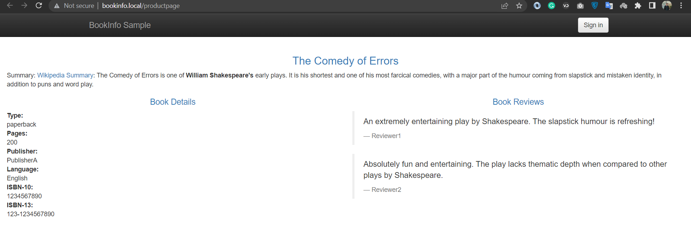
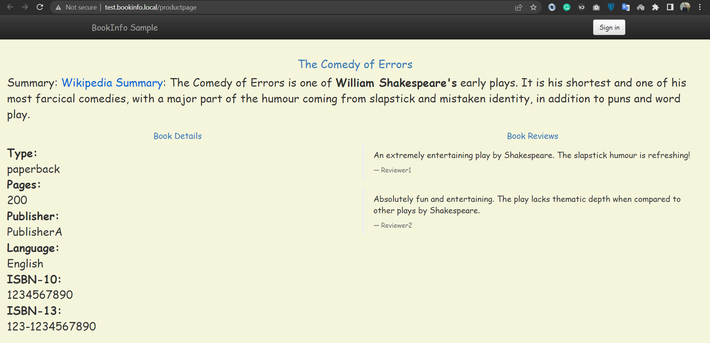
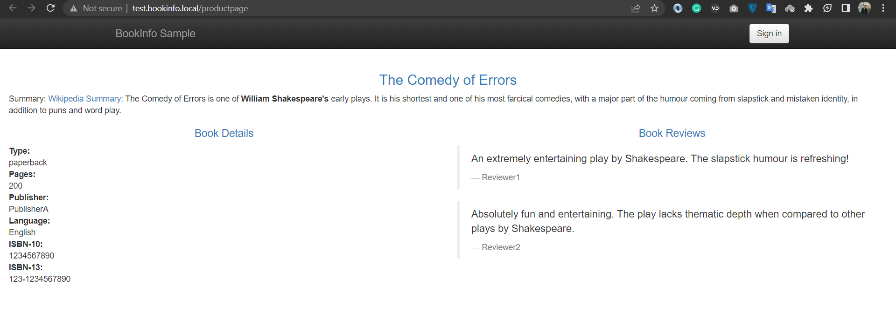

# Demo 2 - Blue/Green Deployment

Launch a new version of the homepage, and switch the domain between live and test versions.

## 2.0 Pre-reqs

Deploy Istio & bookinfo:

```
../../../kube/cleanup.sh

kubectl apply -f ../setup/
```

## 2.1 Deploy v2

Using existing gateway:

```
kubectl describe gateway bookinfo-gateway
```

Deploy [v2 product page with test domain](productpage-v2.yaml):

```
kubectl apply -f productpage-v2.yaml
```

Check deployment:

```

kubectl get pods -l app=productpage

kubectl describe vs bookinfo

kubectl describe vs bookinfo-test
```

Add `bookinfo.local` domains to hosts file:

```
cat C:\Windows\System32\drivers\etc\hosts

# on Linux or Mac add to `/etc/hosts`
```

<div align="center">

<i>hosts file</i>
</div>

> Browse to live v1 set at http://bookinfo.local/productpage

> Browse to test v2 site at http://test.bookinfo.local/productpage

<div align="center">

<i>bookinfo.local/productpage (reviews v1)</i>
</div>

<div align="center">

<i>test.bookinfo.local/productpage (reviews v2)</i>
</div>

## 2.2 Blue/green deployment - flip

Deploy [test to live switch](./productpage-test-to-live.yaml)

```
kubectl apply -f productpage-test-to-live.yaml
```

Check live deployment:

```
kubectl describe vs bookinfo
```

> Live is now v2 at http://bookinfo.local/productpage

<div align="center">

<i>bookinfo.local/productpage (reviews v2)</i>
</div>

Check test deployment:

```
kubectl describe vs bookinfo-test
```

> Test is now v1 at http://test.bookinfo.local/productpage

<div align="center">

<i>test.bookinfo.local/productpage (reviews v1)</i>
</div>

## 2.3 Blue/green deployment - flip back

Deploy [live to test switch](./productpage-live-to-test.yaml)

```
kubectl apply -f productpage-live-to-test.yaml
```

> Live is back to v1 http://bookinfo.local/productpage

> Test is back to v2 http://test.bookinfo.local/productpage


> Go to [demo3](../demo3/README.md)