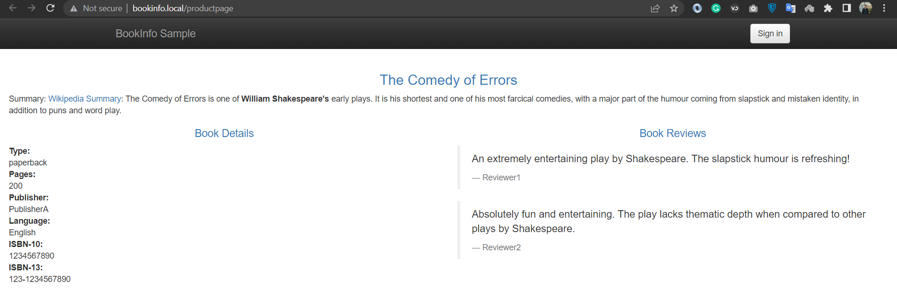
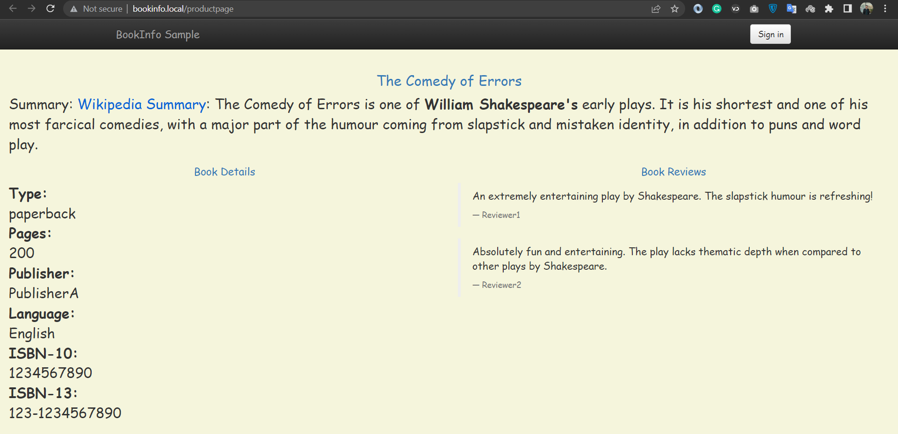
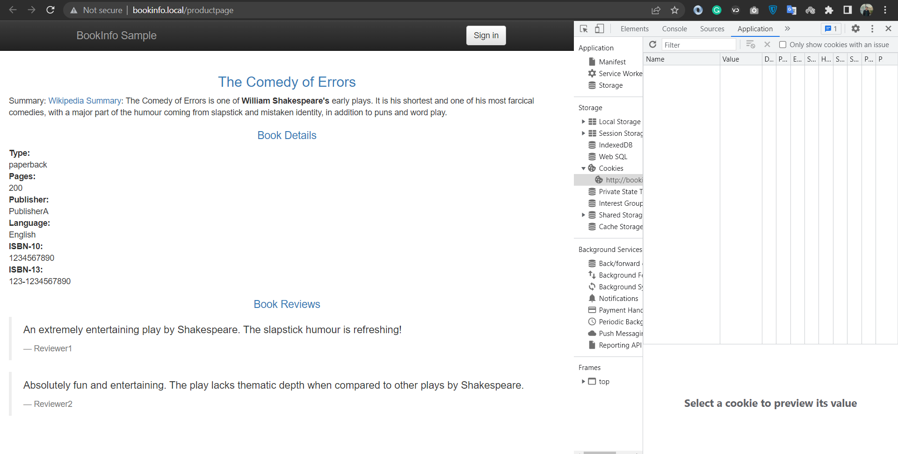
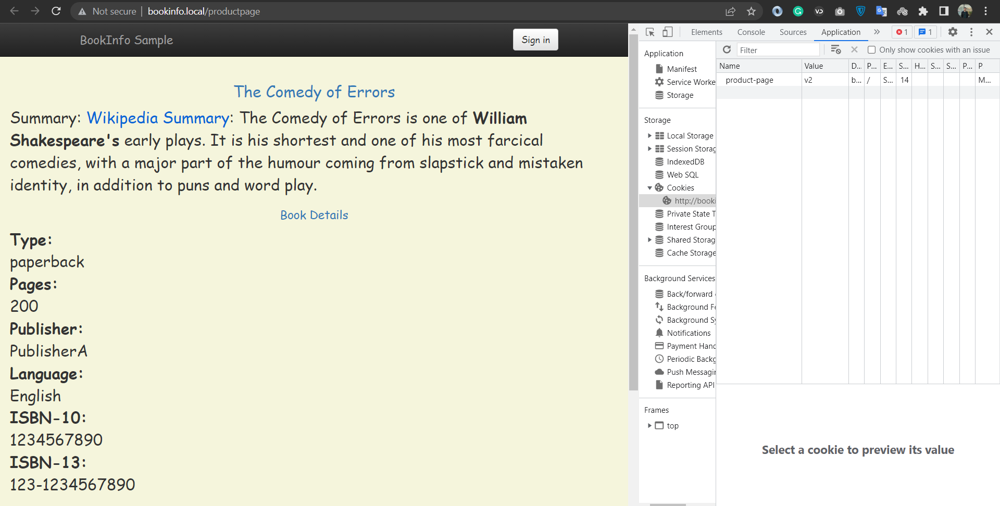

# Demo 3 - Canary Deployment

## 3.0 Pre-reqs

Follow the steps from [Demo 2](../demo2/README.md).


## 3.1 Canary with 30% traffic to v2

Deploy [canary rules with 70/30 split](productpage-canary-70-30.yaml)

```
kubectl apply -f productpage-canary-70-30.yaml
```

Check deployment:

```
kubectl describe vs bookinfo-test

kubectl describe vs bookinfo
```

> Browse to http://bookinfo.local/productpage & refresh, mostly v1 responses with some v2

<div align="center">

<i>70% chance to get review v1</i>
</div>

<div align="center">

<i>30% chance to get review v2</i>
</div>

## 3.2 Canary rollout

Shift traffic to v2:

- [55/45 split](productpage-canary-55-45.yaml)
- [25/75 split](productpage-canary-25-75.yaml)
- [0/100 split](productpage-canary-0-100.yaml)

## 3.3 Canary with sticky session

Deploy [canary split with with cookie](productpage-canary-with-cookie.yaml):

```
kubectl apply -f productpage-canary-with-cookie.yaml
```

> Browse to http://bookinfo.local/productpage & refresh - once you hit v2 that puts a cookie in your browser, and you'll always get v2

Check by disabling cookies:

_e.g. in Firefox_
- Options
- Search "cookies"
- Manage permissions
- Add `bookinfo.local` - with `Block`

> Browse to http://bookinfo.local/productpage & refresh - back to 70/30 split

<div align="center">

<i>70% chance to get review v1</i>
</div>

<div align="center">

<i>once get review v2 you will always get it</i>
</div>

> Go to [demo4](../demo4/README.md)