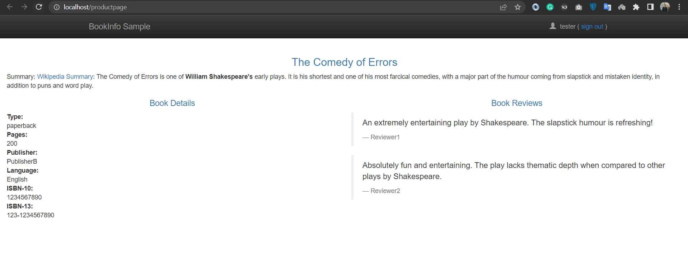
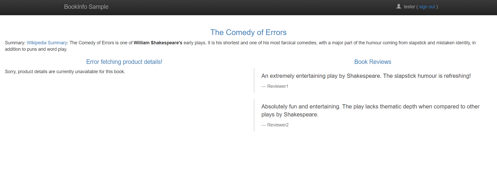

# Demo 4: Circuit Breaker

Add outlier detection to a load-balanced servcie so unhealthy endpoints are removed.

## 4.0 Pre-reqs

Deploy Istio & bookinfo:

```
../../../kube/cleanup.sh

kubectl apply -f ../setup/
```

## 4.1 v2 details service

Deploy [service update with 4 replicas](details-v2.yaml):

```
kubectl apply -f details-v2.yaml
```

Check deployment:

```
kubectl describe service details

kubectl describe vs details

kubectl describe dr details
```

> Browse to http://localhost/productpage & refresh lots. Around 50% of details call fail.

Check logs:

```
kubectl logs -l version=v2 -f
```

<div align="center">

<i>healthy pod</i>
</div>

<div align="center">

<i>unhealthy pod</i>
</div>

## 4.2 Apply circuit breaker

Deploy [updated rules with outlier detection](details-circuit-breaker.yaml):

```
kubectl apply -f details-circuit-breaker.yaml
```

Check deployment:

```
kubectl describe dr details
```

> Browse to http://localhost/productpage & refresh lots. As pods return errors they get excluded - after a while there are no errors, requests only go to healthy pods.

> Go to [demo1 in toturial 3](../../../03/demos/demo1/README.md)
