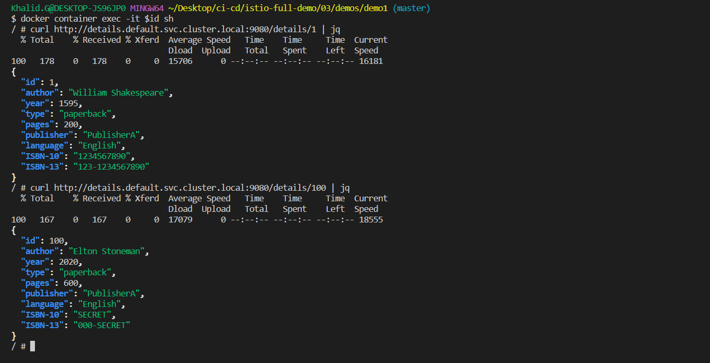

# Demo 1 - Securing Services with Mutual TLS

Encrypting traffic between services with TLS and requiring a client certificate.

## 1.0 Pre-reqs

Deploy Istio, bookinfo & legacy app:

```
../../../kube/cleanup.sh

kubectl apply -f ../setup/
```

> The [legacy app deployment](../setup/06_sleep.yaml) is not running through Istio

## 1.1 Hack the details API

Find the legacy app container:

```
docker container ls --filter name=k8s_sleep

id=$(docker container ls --filter name=k8s_sleep --format '{{ .ID}}')
```

Run a shell in the container:

```
docker container exec -it $id sh
```

Use the details API:

```
curl http://details.default.svc.cluster.local:9080/details/1

curl http://details.default.svc.cluster.local:9080/details/100
```

<div align="center">

<i>hack details pod from another pod in different namespace</i>
</div>

## 1.2 Secure the bookinfo services

> In a new session

Enforce mTLS for [all services in the default namespace](mutual-tls.yaml):

```
kubectl apply -f mutual-tls.yaml
```

> Back to the sleep container session

Check the API again:

```
curl http://details.default.svc.cluster.local:9080/details/100
```

> And check http://localhost/productpage

<div align="center">

<i>hack details pod from another pod in different namespace with disabled mutual-tls</i>
</div>

<div align="center">

<i>productpage with tls disabled</i>
</div>

## 1.3 Apply mTLS for client and service

Add [specefic MTLS for just a specefic components](mutual-tls-istio-auth.yaml):

```
kubectl apply -f mutual-tls-istio-auth.yaml
```

> Back to the sleep container session

Check the API again:

```
curl http://details.default.svc.cluster.local:9080/details/100
```

> And check http://localhost/productpage

<div align="center">

<i>faild because strict mode in tls and pod in different namespace</i>
</div>

<div align="center">

<i>productpage with mutual-tls strict mode</i>
</div>

## 1.4 Dig into the TLS certs

Connect the product page proxy:

```
docker container ls --filter name=istio-proxy_productpage

docker container exec -it $(docker container ls --filter name=istio-proxy_productpage --format '{{ .ID}}') bash
```

Access the details API:

```
curl http://details:9080/details/100

curl https://details:9080/details/100

curl -k https://details:9080/details/100
```
<div align="center">

<i>connect to details pod from productpage proxy</i>
</div>

Check the certs generated by Istio:

```
kubectl get secrets -n istio-system
```

## 1.5 Hack details API from product page


**This mTLS setup doesn't secure from end-user attack**

Run a shell in the product page container:

```
kubectl exec -it productpage -c productpage -- bash
```

Access the details API:

```
curl http://details:9080/details/100

python
import urllib.request
urllib.request.urlopen("http://details:9080/details/100").read()
quit()

exit
```
<div align="center">

<i>connect to details pod from productpage proxy</i>
</div>

> Go to [demo2](../demo2/README.md)