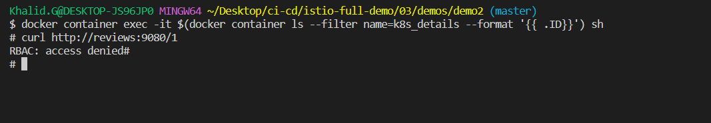

# Demo 2 - Service Authorization

Enforce access control for services based on the caller's mTLS identity.

## 2.0 Pre-reqs

Follow the steps from [Demo 1](../demo1/README.md).

## Restrict access to all components:
Apply a [deny-all authorization policy](reviews-deny-all.yaml) for the service:

```
kubectl apply -f reviews-deny-all.yaml
```

<div align="center">

<i>access denied for all componantsy</i>
</div>

## 2.1 Restrict access to reviews

Apply a [deny-all authorization policy](reviews-deny-all-just-for-reveis.yaml) for the service:

```
kubectl apply -f reviews-deny-all-just-for-reveis.yaml
```

> Check http://localhost/productpage

<div align="center">

<i>deny only reviews</i>
</div>

## 2.2 Allow access from product page

Apply the [updated authorization policy](reviews-allow-productpage.yaml) to allow service access:

```
kubectl apply -f reviews-allow-productpage.yaml
```
<div align="center">

<i>only productpage can access reviews</i>
</div>

<div align="center">

<i>access reviews from details container denied because its only allowed for bookinfo-productpage</i>
</div>

And you can allow all trafic from namespace by using namespace instead of princibles
Apply a [Allow All Get trafic from Deafault ns](reviews-allow-services-in-default-ns.yaml) for the service:
```
kubectl apply -f reviews-allow-services-in-default-ns.yaml
```
<div align="center">

<i>access reviews from details container are now allowed</i>
</div>

> And check http://localhost/productpage

## 2.3 Try from unauthorized service

Run a shell in the details API container:

```
docker container ls --filter name=k8s_details

docker container exec -it $(docker container ls --filter name=k8s_details --format '{{ .ID}}') sh
```

Try accessing the reviews & ratings APIs:

```
curl http://reviews:9080/1

curl http://ratings:9080/ratings/1
```

<div align="center">

<i>access ratings from details container</i>
</div>


> Go to [demo3](../demo3/README.md)