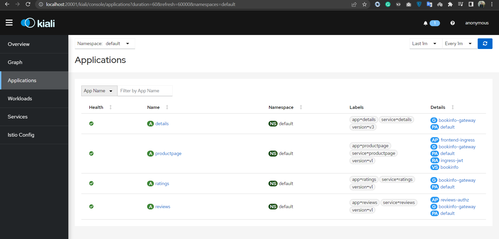
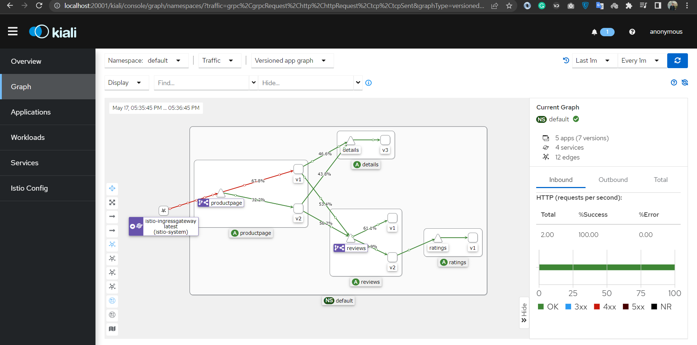

# Demo 1 - Visualizing the Service Mesh

Using [Kiali](https://kiali.io) to graph active services and see the traffic flow between them.

## 1.0 Apply istio addons:

```
kubectl apply -f <Istio-folder>/samples/addons
```

## 1.1 Publish the Kiali UI

Deploy a [Gateway and VirtualService](kiali.yaml) for Kiali:

```
istioctl dashboard kiali
```

- App graph in _Graph_
- Check `productpage` in Kiali _Workloads_

<div align="center">

<i>Kiali UI</i>
</div>

## 1.2 Canary deployment for v2

Deploy [v2 product page](./v2/productpage-v2-canary.yaml) and [v2 reviews API](./v2/reviews-v2-canary.yaml) updates:

```
kubectl apply -f ./v2/
```

> Browse to http://bookinfo.local/productpage and refresh 

- Back to Kiali
- Switch versioned app graph
- Add _Requests percentage_ label
- Check bookinfo virtual service in _Istio Config_ (editable!)

## 1.3 Generate some load

Use [Fortio](https://fortio.org) to send a few hundred requests to the app:

```
docker run  fortio/fortio load -c 32 -qps 25 -t 30s http://MACHINE_IP/productpage
```

- Back to Kiali _Graph_

<div align="center">

<i>requests load with kiali</i>
</div>

> Go to [demo2](../demo2/README.md)