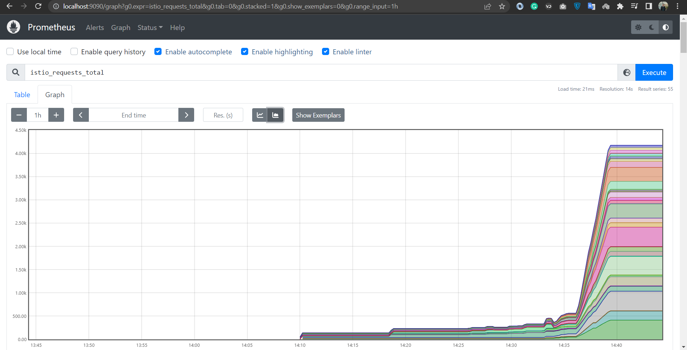
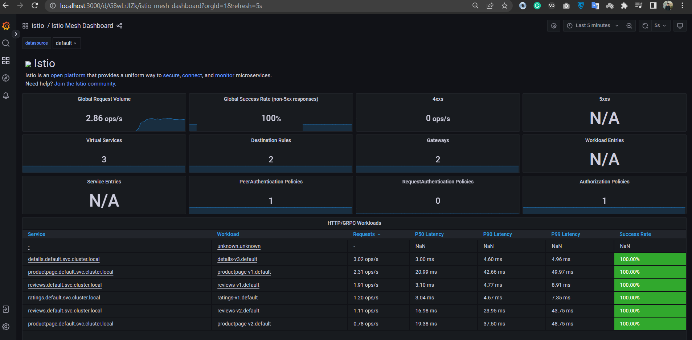
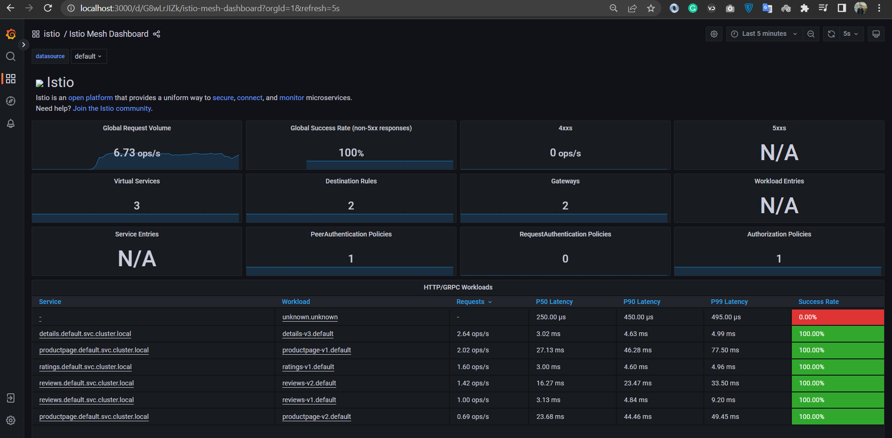

# Demo 2 - Monitoring with Prometheus & Grafana

See the metrics coming into [Prometheus](https://prometheus.io) and the Istio dashboards in [Grafana](https://grafana.com).

## 2.0 Pre-reqs

Follow the steps from [Demo 1](../demo1/README.md).

## 2.1 Publish the Prometheus UI

Deploy a [Gateway and VirtualService](prometheus.yaml) for Prometheus:

```
istioctl dashboard prometheus
```

> Browse to http://localhost:15030

- Select `istio_requests_total`
- Switch to _Graph_
- Check _Status_/_Targets_ - Kubernetes service discovery

## 2.2 Generate some load

Send requests for next 30 minutes:

```
docker run  fortio/fortio load -c 32 -qps 25 -t 30s http://MACHINE_IP/productpage
```

- Back to _Graph_ view in Prometheus

<div align="center">

<i>prometheus</i>
</div>

## 2.3 Publish the Grafana UI

> New terminal

Deploy a [Gateway and VirtualService](grafana.yaml) for Grafana:

```
istioctl dashboard grafana
```

> Browse to http://localhost:15031

 - _Istio Mesh Dashboard_ - overview
 - _Istio Service Dashboard_ - drill down into service 

<div align="center">

<i>grafana</i>
</div>

## 2.4 Deploy a failing service

Update the [v2 reviews service](reviews-v2-abort.yaml) to add `503` faults:

```
kubectl apply -f reviews-v2-abort.yaml
```
<div align="center">

<i>grafana</i>
</div>

> Go to [demo3](../demo3/README.md)